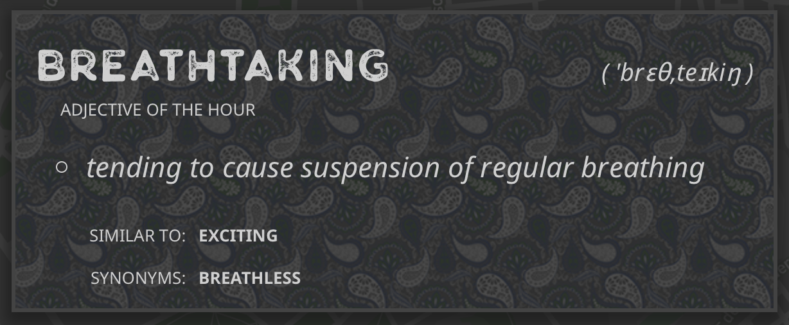

# Word of the... Übersicht Widget
In honour of this year's [NaNoWriMo][1], here is an [Übersicht][2] widget that displays a \[Part of Speech\] of the \[Refresh Frequency\], using WordsAPI.

## In Action

In order to use, you have to [get your own API Key for WordsAPI from Mashape][3].  The service requires you to put down a credit card, but the free tier is generous, at *2500* requests per day.

Once you have that, fill in the options at the top of the word-of-the.coffee file.

Also: The Synonyms and Similar-To's are clickable, and will switch to the new word!

## Colophon
Words and WordsAPI from [https://www.wordsapi.com/][4]
Klasik Rough font from [http://freedesignresources.net/klasik-sans-free-typefamily/][5]
Noto font from [https://www.google.com/get/noto/][6]
Amoebae Pattern from o2bqueen and yenvious at [http://www.colourlovers.com/pattern/5475717/Amoebae][7]

[1]: http://nanowrimo.org/
[2]: http://tracesof.net/uebersicht-widgets/
[3]: https://market.mashape.com/wordsapi/wordsapi
[4]: https://www.wordsapi.com/
[5]: http://freedesignresources.net/klasik-sans-free-typefamily/
[6]: https://www.google.com/get/noto/
[7]: http://www.colourlovers.com/pattern/5475717/Amoebae
